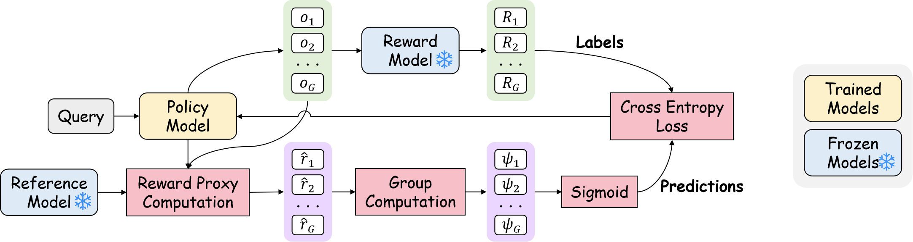

# PACS: Implicit Actor Critic Coupling via a Supervised Learning Framework for RLVR

<a href=''></a>

<!-- ## 🤩 Release -->



## 😎 Overview

**PACS**, a novel RLVR framework that achieves im**P**licit **A**ctor **C**ritic coupling via a **S**upervised learning framework. By treating the outcome reward as a predictable label, we reformulate the RLVR problem into a supervised learning task over a score function parameterized by the policy model and optimized using cross-entropy loss.

Benchmarking on challenging mathematical reasoning tasks, **PACS** outperforms strong RLVR baselines, such as PPO and GRPO, achieving superior reasoning performance. For instance, **PACS** achieves 59.78% at pass@256 on AIME 2025, representing improvements of 13.32 and 14.36 points over PPO and GRPO.

## 🧐 Quickstart

### Prepare Environment

**Docker**

The Dockerfile provided by `verl` is modified with some adjustments and additional necessary packages.
You need to create a Docker image using the provided Dockerfile and start the container. The following bash commands can be used as reference.

```shell
docker build -t pacs .
```

```shell
docker run \
    -itd \
    --gpus all \
    --privileged --cap-add=IPC_LOCK \
    --ulimit memlock=-1 --ulimit stack=67108864 \
    --entrypoint /bin/bash \
    --mount type=bind,source=/path/to/your/data,target=/data,bind-propagation=rshared \
    --net=host \
    --ipc=host \
    --pid=host \
    --name=pacs pacs
```

**Ray**

Since the `verl` depends on `Ray`, for single node training, `verl` can automatically start a `Ray` cluster on the node.

However, if we want to use multiple nodes for training, we need to manually start the `Ray` cluster in advance.

The command for the head node is

```shell
ray start --head --port=$PORT
```

and the command for other nodes is

```shell
ray start --address=$HEAD_NODE:$PORT
```

For more usage of `ray start`, see: https://docs.ray.io/en/latest/cluster/cli.html#ray-start

**`verl`**

Since the `verl` framework has been updated frequently, we directly place its source code in the `src` directory to facilitate version alignment and reproduction for everyone. The version of verl we use is `432f9e`. We only modified the [tensorboard save path related code](https://github.com/volcengine/verl/commit/5d54876b481bb82072a8032d11c100d05d432fd0) to make it more organized.

**Code Repo**

```shell
git clone https://github.com/ritzz-ai/PACS
cd pacs/src
```

### Data Preprocess

The [DeepScaleR](https://huggingface.co/datasets/agentica-org/DeepScaleR-Preview-Dataset) dataset is used for training, and the [MATH 500](https://huggingface.co/datasets/HuggingFaceH4/MATH-500), [AMC23](https://huggingface.co/datasets/zwhe99/amc23), [AIME 2024](https://huggingface.co/datasets/Maxwell-Jia/AIME_2024), and [AIME 2025](https://huggingface.co/datasets/yentinglin/aime_2025) datasets are used for testing.

The datasets need to be processed to unify their formats (as shown in [here](./scripts/preprocess_dataset.sh)). The `repeat` represents how many times a question should be repeated, and it can be set to the default value of 1 here.

```shell
python preprocess_dataset.py \
    --input_path ../datasets/aime_2024/aime_2024_problems.parquet\
    --repeat 1
```

### PACS

Training scripts for PACS with different beta values are provided in [./scripts/pacs](./scripts/pacs).

```shell
bash ../scripts/pacs/pacs_beta_1.0.sh
```

Here, some key parameters are explained.

| Parameter       | Description                                                         |
| --------------- | ------------------------------------------------------------------- |
| `ADV_ESTIMATOR` | The type of advantage estimator to use.                             |
| `BETA`          | The value of the beta.                                              |
| `USE_WEIGHT`    | Whether to use different weights for positive and negative samples. |

For details on other parameters, see the [verl doc](https://verl.readthedocs.io/en/latest/examples/config.html).

We also provide scripts for [GRPO](./scripts/baseline/grpo.sh) and [PPO](./scripts/baseline/ppo.sh).

```shell
# grpo
bash ../scripts/baseline/grpo.sh
# ppo
bash ../scripts/baseline/ppo.sh
```

After training is complete, the model weights need to be converted from the FSDP format to the HF format for inference.

We provide a [shell script](./scripts/model_merge.sh) to automate this process. You only need to set the corresponding `CHECKPOINTS_DIR`, and the script will automatically convert the weights from different global steps within that path to the HF format. To save storage space, it will also delete the original FSDP weights if HF format exists.

Alternatively, you can perform the conversion manually using the command below.

```shell
python model_merger.py merge \
    --backend fsdp \
    --local_dir "$CHECKPOINT_PATH/actor" \
    --target_dir "$CHECKPOINT_PATH/hf"
```

### Evaluation

To run inference and evaluation, set the path of your model weights in [inference.sh](./scripts/inference.sh) and then execute the script. The parameter `N` denotes the number of responses to generate for each question,which facilitates the evaluation of the pass@k metric.

After the test completes, the following files will be generated in the same directory as the weights:

- `eval_rollout.jsonl`: Contains the actual generated responses.
- `eval_metrics.json`: Records the final evluation metrics.

### Result

We present the key results from our experiments here. The complete set of results can be found in the paper.


## 😘 Citation

If you finding our work interesting or helpful to you, please cite this repo.

```plain

```
